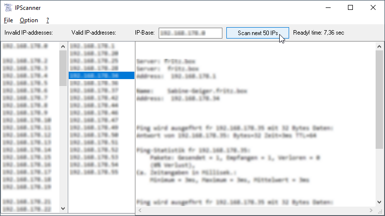

# IPScanner  
## Scans IP addresses in the LAN using nslookup and ping  
Uses nslookup to do an optionally selectable amount of scans each time you click the Scan Button.
If you doubleclick one IP-address additionally ping will be called.
Project was started in nov 2019
